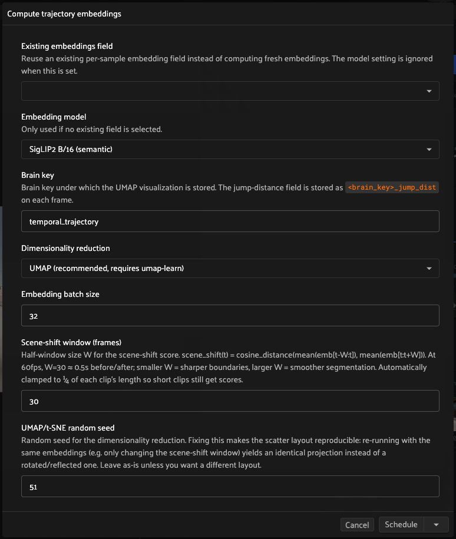
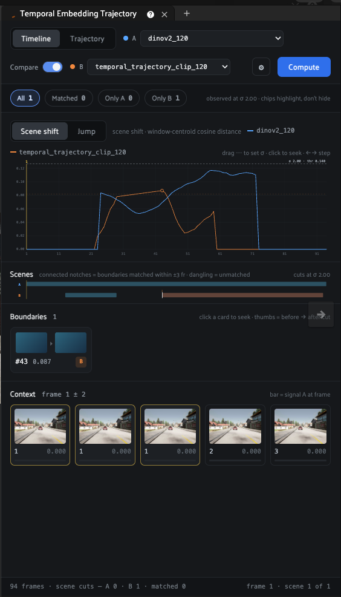
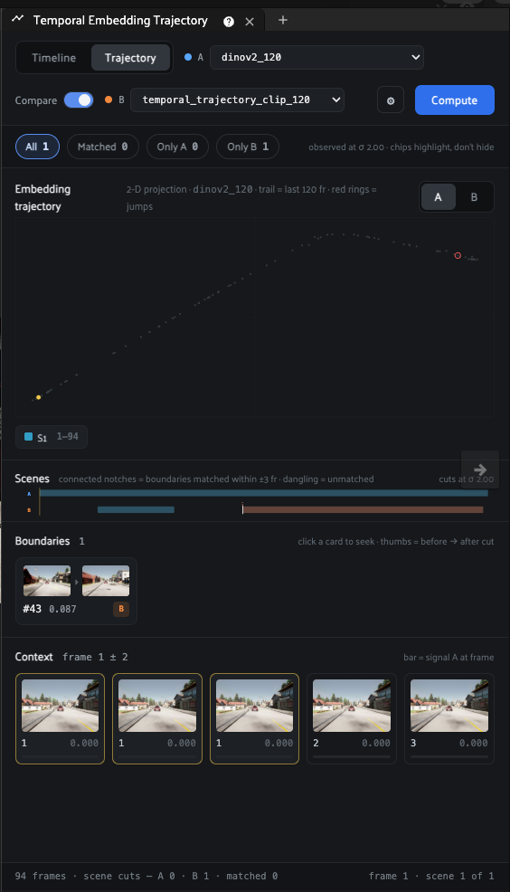

# Temporal Embedding Trajectory

A [FiftyOne](https://github.com/voxel51/fiftyone) panel for analyzing **per-frame
embedding trajectories** of videos. It embeds every frame, scores how much the
scene is changing, and plots the result so you can *see* where a model's
understanding of the video shifts — useful for finding the exact frames where
something changes (lighting, occlusion, a tunnel entrance, a new object, a false
detection).

## Install

### FiftyOne Enterprise (Teams) — recommended

1. **Download this repository as a ZIP** — on GitHub click **Code → Download ZIP**
   (or zip a local clone).
2. In the App, go to **Settings → Plugins → Install plugin** and upload the ZIP.
3. (Optional) set operator permissions under the plugin's entry.

Or via the Management SDK:

```python
import fiftyone.management as fom
fom.upload_plugin("/path/to/temporal-embedding-trajectory.zip")
```

The ZIP ships a prebuilt JS bundle (`dist/index.umd.js`), so no build step is
needed at install time.

### FiftyOne OSS

```bash
fiftyone plugins download https://github.com/voxel51/temporal-embedding-trajectory
```

or copy this directory into your `FIFTYONE_PLUGINS_DIR`.

## Usage

1. Install the plugin (above).
2. Open a **video** dataset and add the **Temporal Embedding Trajectory** panel
   (the `+` panel menu). Click **Compute** and choose a model + options (see
   [Compute](#compute)). This runs the `compute_trajectory_embeddings`
   operator, which embeds the frames, projects them to 2D, and writes the
   `<brain_key>_jump_dist` and `<brain_key>_scene_shift` frame fields. On
   Enterprise this runs as a scheduled/delegated operation (watch the dataset's
   **Runs** tab).
3. Once the run finishes, **open a video sample** and add the panel **in the
   sample modal** to explore. Video playback drives the yellow cursor across
   every view; clicking anywhere in the charts seeks the video.

### Compute



| Field | Meaning |
|-------|---------|
| **Existing embeddings field** | Reuse an existing per-frame embedding field instead of running a model (the model setting is then ignored). |
| **Embedding model** | `SigLIP2 B/16` (semantic — *what* is in the frame) or `DINOv2 ViT-B/14` (visual — *how* it looks). They catch different kinds of change — comparing them is the point of Compare mode. |
| **Brain key** | Where the UMAP projection is stored; also the prefix for the `_jump_dist` / `_scene_shift` frame fields. |
| **Dimensionality reduction** | UMAP (default, needs `umap-learn`), t-SNE, or PCA. Seeded, so layouts are reproducible across runs. |
| **Scene-shift window (W)** | Half-window for the scene-shift score. Smaller = sharper boundaries, larger = smoother. Automatically clamped to ¼ of each clip's length so short clips still get scores. |

## The panel

The panel has **two views** — Timeline and Trajectory — plus an evidence rail
(scenes band, boundary cards, context filmstrip) that persists under both.

### Timeline



One chart, two metrics — toggle between them at the top left:

- **Scene shift** — `cosine_distance(mean(emb[t−W:t]), mean(emb[t:t+W]))`, the
  windowed centroid score. Catches *gradual* transitions (tunnel entry/exit)
  that per-frame distances smooth over.
- **Jump** — frame-to-frame cosine distance. Catches *abrupt* single-frame
  events.

Each metric keeps its own **σ threshold** — the dashed line on the chart.
**Drag the dashed line** to tune it; peaks above it become detected events
(markers on the curve). **Click anywhere to seek** the video; **←/→ step
frames** (⇧ = ×10); hovering shows per-model values.

Flip on **Compare** to overlay a second model (B, orange). The chips row counts
**All / Matched / Only A / Only B** events — matched within the ± frame
tolerance. Chips **highlight** the event list below (non-matching cards dim,
never disappear). Frames where *both* models spike are high-confidence scene
changes; disagreements tell you what one embedding sees that the other misses.

### Trajectory



The 2-D projection of the embedding space. Grey dots are all frames; the
**colored trail** connects the last N frames up to the cursor (hue = scene, per
the detected boundaries); **red rings** mark jump frames; the **yellow dot** is
the current frame. In Compare mode an A/B switch flips which model's projection
you're looking at. Scene chips underneath seek to each segment.

Coherent scenes form tight clusters here — and a frame whose trail wanders into
a *different* cluster is temporally in one scene but visually in another: the
"out of place" anomaly this panel was built to surface.

### Evidence rail (both views)

- **Scenes band** — each model's scene segments with white notches at cuts. In
  Compare mode, connectors join cuts matched within tolerance; dashed stubs are
  unmatched cuts.
- **Boundaries** — one card per detected event: before → after thumbnails,
  frame number, peak value, and an `A+B` / `A` / `B` badge. Click to seek.
- **Context** — filmstrip of frames around the cursor with a per-frame signal
  bar.

Niche knobs (Scene σ, Jump σ, match tolerance, context radius, trail length)
live in the **⚙** popover.

## Requirements

See [`requirements.txt`](requirements.txt). `numpy` + `fiftyone-brain` are
required; `umap-learn` for the default UMAP method (PCA / t-SNE need no extra
dependency). Computing **new** embeddings with the built-in SigLIP2 / DINOv2 zoo
models also needs `torch` + `torchvision` (plus `transformers>=4.51` for
SigLIP2) — not needed if you project an existing per-frame embeddings field.

## How it works

- **Python** ([`panel.py`](panel.py), [`operators.py`](operators.py)): a `Panel`
  that renders a `composite_view` React component named
  `TemporalEmbeddingTrajectoryView`, plus the `compute_trajectory_embeddings`
  operator. `jump_dist(t)` = cosine distance between consecutive frame
  embeddings; `scene_shift(t)` = the windowed boundary score above. Event
  detection, matching, and scene assignment happen client-side, so the σ
  thresholds and tolerance respond instantly.
- **JavaScript** ([`src/`](src)): the React views, bundled to
  [`dist/index.umd.js`](dist/index.umd.js) (~34 KB). Charts are hand-rolled
  SVG — no charting library. The bundle self-registers the component and
  externalizes the FiftyOne app's runtime globals (React, recoil,
  `@fiftyone/*`).

## Development

The JS bundle is **prebuilt and committed**, so no build is needed to install.
The repo also builds **standalone** — no FiftyOne checkout required, since all
`@fiftyone/*` imports are externalized to the app's runtime globals:

```bash
npm install
npm run build    # -> dist/index.umd.js (IIFE; externalizes app globals)
```

The externalized APIs are stable across FiftyOne 1.x; keep `fiftyone.version`
in [`fiftyone.yml`](fiftyone.yml) aligned with the releases you deploy to.

## License

Apache 2.0
