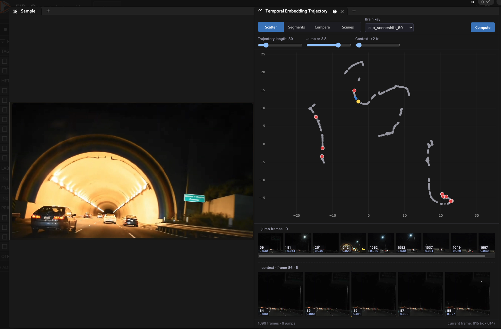
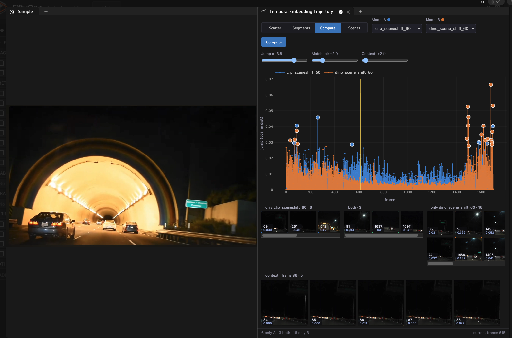
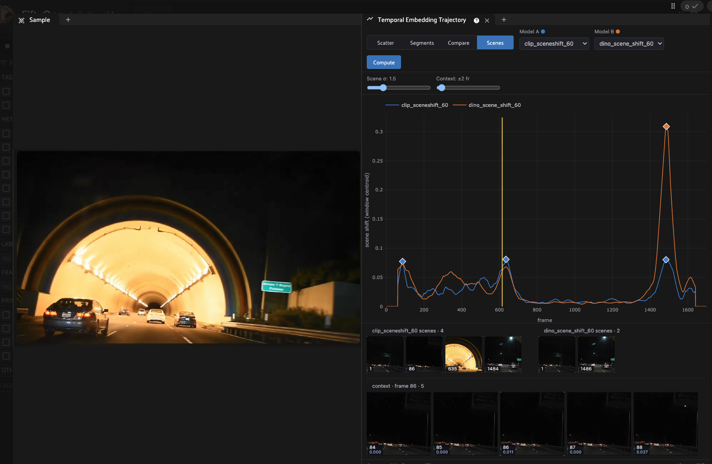

# Temporal Embedding Trajectory

A [FiftyOne](https://github.com/voxel51/fiftyone) panel for analyzing **per-frame
embedding trajectories** of videos. It embeds every frame, projects the
embeddings to 2D (UMAP), and plots them so you can *see* where a model's
understanding of the scene shifts — useful for finding the exact frames where
something changes (lighting, occlusion, a tunnel entrance, a new object, a false
detection).

## Install

### FiftyOne Enterprise (Teams) — recommended

1. **Download this repository as a ZIP** — on GitHub click **Code → Download ZIP**
   (or zip a local clone).
2. In the App, go to **Settings → Plugins → Install plugin** and upload the ZIP.
3. (Optional) set operator permissions under the plugin's entry.

Or via the Management SDK:

```python
import fiftyone.management as fom
fom.upload_plugin("/path/to/temporal-embedding-trajectory.zip")
```

The ZIP ships a prebuilt JS bundle (`dist/index.umd.js`), so no build step is
needed at install time.

### FiftyOne OSS

```bash
fiftyone plugins download https://github.com/voxel51/temporal-embedding-trajectory
```

or copy this directory into your `FIFTYONE_PLUGINS_DIR`.

## Usage

1. Install the plugin (above).
2. Open a **video** dataset and open the **Temporal Embedding Trajectory** panel
   (the `+` panel menu).
3. Click **Compute** and choose a model + options (see [Compute](#compute)). This
   runs the `compute_trajectory_embeddings` operator, which embeds the frames,
   projects them, and writes the `<brain_key>_jump_dist` and
   `<brain_key>_scene_shift` frame fields. On Enterprise this can run as a
   scheduled/delegated operation (watch the dataset's **Runs** tab).
4. Select the computed **brain key** and explore the four tabs below. Video
   playback drives the yellow current-frame cursor across every view.

### Compute


| Field | Meaning |
|-------|---------|
| **Existing embeddings field** | Reuse an existing per-frame embedding field instead of running a model (the model setting is then ignored). |
| **Embedding model** | `SigLIP2 B/16` (semantic — *what* is in the frame) or `DINOv2 ViT-B/14` (visual — *how* it looks). |
| **Brain key** | Where the UMAP projection is stored; also the prefix for the `_jump_dist` / `_scene_shift` frame fields. |
| **Dimensionality reduction** | UMAP (default, needs `umap-learn`), t-SNE, or PCA. Seeded for reproducible layouts. |
| **Scene-shift window (W)** | Half-window for the scene-shift score (see [Scenes](#scenes)). Smaller = sharper boundaries, larger = smoother. |

## The panel tabs

### Scatter



Each grey dot is one frame at its position in embedding space (UMAP); a faint
line connects frames in time. The blue **trajectory** highlights the most recent
frames leading up to the **yellow cursor** (the current playback frame). **Red
dots are "jumps"** — frames whose embedding moved sharply from the previous frame
(consecutive-frame cosine distance above the **Jump σ** threshold), i.e. your
scene-change candidates. The **jump frames** strip shows those frames; the
**context** strip shows ±N frames around whatever frame you click.

- **Trajectory length** — how many recent frames the blue trail covers.
- **Jump σ** — how many standard deviations above the mean a frame must jump to be flagged red.
- **Context** — ± frame radius for the context preview strip.

### Segments


The same UMAP geometry as Scatter, but points are **colored by scene segment**.
Segments are the spans between scene-shift boundaries (see [Scenes](#scenes)), so
the legend reads *scene 1, scene 2, …*. This is the scene-mining view: if the
embedding captures distinct scenes, each segment forms its own cluster — and a
frame whose color sits inside a *different* cluster is temporally in one scene but
visually in another (an "out of place" anomaly). The **scene starts** strip shows
the first frame of each segment.

- **Scene σ** — boundary sensitivity (lower = more, smaller segments).
- **Context** — ± frame radius for the context preview.

### Compare



Overlays **two models** (Model A / Model B) on one axis: x = frame, y = per-frame
jump distance (cosine). The key signal is **agreement** — frames where *both*
models spike are high-confidence scene changes (not single-model noise). The
strips break the flagged frames into **only A**, **both**, and **only B**. The
yellow vertical line marks the current playback frame.

- **Jump σ** — outlier threshold for flagging jumps in each model.
- **Match tol** — frame tolerance for counting two models' jumps as "the same" event.
- **Context** — ± frame radius for the context preview.

### Scenes



Plots each model's **windowed scene-shift score** over time: for frame `t`,
`scene_shift(t) = cosine_distance(mean(emb[t-W:t]), mean(emb[t:t+W]))` — the
distance between the average of the previous `W` frames and the next `W`.
Diamonds mark detected **boundaries**. Because it compares windows rather than
adjacent frames, it catches *gradual* transitions (e.g. a tunnel entrance/exit —
the large peak in the screenshot) that the per-frame jump metric smooths over.
The per-model **scenes** strips list each segment's start frame.

- **Scene σ** — peak/boundary detection threshold.
- **Context** — ± frame radius for the context preview.

## Requirements

See [`requirements.txt`](requirements.txt). `numpy` + `fiftyone-brain` are
required; `umap-learn` for the default UMAP method (PCA / t-SNE need no extra
dependency). Computing **new** embeddings with the built-in SigLIP2 / DINOv2 zoo
models also needs `torch` + `torchvision` (plus `transformers>=4.51` for
SigLIP2) — not needed if you project an existing per-frame embeddings field.

## How it works

- **Python** ([`panel.py`](panel.py), [`operators.py`](operators.py)): a `Panel`
  that renders a `composite_view` React component named
  `TemporalEmbeddingTrajectoryView`, plus the `compute_trajectory_embeddings`
  operator. `jump_dist(t)` = cosine distance between consecutive frame
  embeddings; `scene_shift(t)` = the windowed boundary score above.
- **JavaScript** ([`src/`](src)): the React views, bundled to
  [`dist/index.umd.js`](dist/index.umd.js). The bundle self-registers the
  component and externalizes the FiftyOne app's runtime globals (React, recoil,
  `@fiftyone/*`).

## Development

The JS bundle is **prebuilt and committed**, so no build is needed to install. To
rebuild it you need a local FiftyOne **source** checkout (the build externalizes
`@fiftyone/*` and resolves them at build time):

```bash
export FIFTYONE_DIR=/path/to/fiftyone
yarn install
yarn link "$FIFTYONE_DIR/app" --all --private --relative
yarn build          # -> dist/index.umd.js (IIFE; externalizes app globals)
```

Build the bundle against the FiftyOne release your deployment runs, and keep
`fiftyone.version` in [`fiftyone.yml`](fiftyone.yml) aligned.

## License

Apache 2.0
